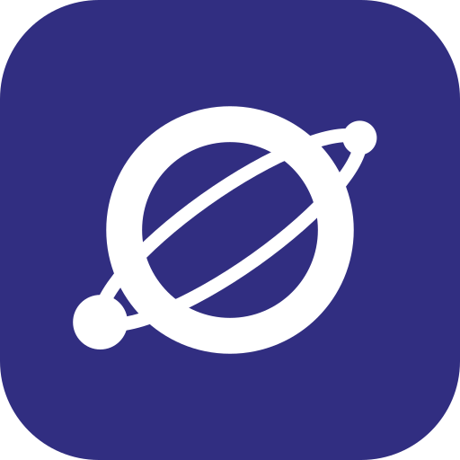

# Orbit — AI Workflow Tool

**Minder nadenken. Meer bouwen.**  
Maak van elk idee direct een uitvoerbare AI-workflow — en bouw ondertussen een portfolio waar je trots op bent.

---

## Wat is Orbit?

**Orbit** is een gratis, installeerbare web-app (PWA) voor studenten en makers. Het helpt je om opdrachten, ideeën en bestanden om te zetten naar duidelijke AI-prompts, checklists en gestructureerde workflows — én om je persoonlijke groei bij te houden in een professioneel portfolio. Volledig in je browser, zonder installatie of account.

---

## Functies in één oogopslag

| Functie | Beschrijving |
|---|---|
| **Nieuwe Opdracht** | Plak je opdracht (bijv. "schrijf een stageverslag") en Orbit splitst hem op in subopdrachten en afvinkbare checklists — met kant-en-klare sjablonen voor rapporten, plannen, sollicitaties en meer |
| **Prompt Genereren** | Bouw van een simpele beschrijving een professionele AI-prompt, compleet met outputformat en kwaliteitscriteria |
| **Bestand → AI** | Upload of plak tekst, briefings of Markdown en analyseer ze met AI-presets (samenvatting, checklist, risico's, verbeterpunten...) |
| **AI → Checklist** | Plak een AI-antwoord en maak er een interactieve, afvinkbare checklist van die je kunt bewaren |
| **AI Launcher** | Start direct bij ChatGPT, Gemini, Claude of Copilot — je prompt wordt automatisch gekopieerd |
| **Portfolio & Doelen** | Beheer leerdoelen, volg je groei en exporteer een professioneel portfolio als PDF *(zie hieronder)* |
| **Notities** | Bewaar ideeën en AI-antwoorden met Markdown, tags en pins — altijd binnen handbereik |
| **Weekreview** | Reflecteer wekelijks: wat ging goed, wat kan beter? En genereer een weekplanning met AI |
| **Globale zoekfunctie** | Zoek direct door taken, notities en doelen met Ctrl+K |
| **Tags & deadlines** | Label, filter en plan je opdrachten — met archief voor afgeronde taken |
| **AI Output naar Opdracht** | Plak ChatGPT-output en sla het op als volledige analyseopdracht |

---

## Portfolio & Doelen — in detail

Dé plek om je ontwikkeling als student bij te houden en te bewijzen.

| Functie | Beschrijving |
|---|---|
| **Leerdoelen met niveaus** | Stel doelen zoals "Presenteren", "Onderzoek doen" of "Samenwerken" in met een startniveau (1–100), categorie en mijlpalen |
| **Nieuwe doelen ontdekken** | Beantwoord ~20 AI-vragen over je werk, interesses en ambities en krijg automatisch passende nieuwe leerdoelen voorgesteld (per voorstel accepteren of weigeren) |
| **Groei analyseren** | Plak je werk/verslagen en laat AI je groei per leerdoel beoordelen volgens een **strenge HBO-rubric** (0–25 punten, met onderbouwing per niveau) — voorgestelde groei per doel accepteren of weigeren |
| **Groeigeschiedenis & groeidiagram** | Elke aanpassing van je niveau wordt gelogd met reden en datum; in de PDF-export verschijnt een lijndiagram van je niveauverloop per doel |
| **Mijn werk per doel** | Voeg tekst, een link naar een site, of een verslag toe aan elk leerdoel — links worden als nette kaarten getoond |
| **Bijlagen & links** | Algemene links/bestanden (bijv. je LinkedIn of eindverslag) die niet aan één doel hangen, apart bewaard en meegenomen in de PDF |
| **Alle groei wissen** | Zet alle niveaus terug naar het startniveau en wis de groeigeschiedenis — handig bij een nieuwe periode |
| **Professionele PDF-export** | Kleurkeuze, voorpagina met logo en je gegevens, statistieken, vaardighedenradar, groeidiagram, je werk/links als kaarten — alles in je gekozen icoonstijl |

---

## Maak het van jou — Instellingen

| Instelling | Mogelijkheden |
|---|---|
| **Thema's** | Indigo Licht, Indigo Donker, Mono Licht, Mono Donker — of stel élke kleur zelf in en sla op als preset |
| **Icoonstijl** | Kies tussen emoji, Lucide, Material Symbols (3 varianten) of Phosphor — de hele app past zich aan, ook de PDF-export |
| **Lettertype** | 15+ Google Fonts om uit te kiezen |
| **Backup & herstel** | Exporteer ál je data als bestand met één klik en importeer hem later weer — ideaal bij wisselen van apparaat of browser |
| **Sjablonen & presets** | Beheer je eigen opdracht-sjablonen en AI-presets, elk met eigen prompt en variabelen |

---

## Installeren als app (PWA)

Orbit is een Progressive Web App — installeer hem als echte desktop- of mobiele app.

**Desktop (Chrome of Edge)**
1. Ga naar [karambaboy123.github.io/orbit](https://karambaboy123.github.io/orbit/)
2. Klik op het installatie-icoon in de adresbalk
3. Klik Installeren — Orbit staat nu in je taakbalk

**Android**
1. Open Chrome en ga naar de site
2. Tik op het menu en kies Toevoegen aan startscherm

**iPhone (Safari)**
1. Open Safari en tik op het deel-icoon
2. Kies Zet op beginscherm

Updates worden automatisch op de achtergrond geladen. Geen herinstallatie nodig.

---

## Privacy — Data wordt lokaal opgeslagen

> Al je data (taken, notities, doelen, instellingen) wordt opgeslagen in de **localStorage van je browser**.

| | |
|---|---|
| Volledig privé | Niets gaat naar een server |
| Geen account | Direct beginnen, niets aanmaken |
| Werkt offline | Dankzij de ingebouwde service worker |
| Let op | Data verdwijnt als je je browsercache leegmaakt |
| Let op | Niet automatisch gesynchroniseerd tussen apparaten |

**Tip:** Maak regelmatig een backup via Instellingen → Gegevens & Export → Exporteer backup.

---

## Techniek

- Pure HTML, CSS en JavaScript — geen framework, geen build-stap
- Tailwind CSS via CDN
- Lucide, Material Symbols en Phosphor Icons — icoonstijl instelbaar door de hele app
- Marked.js en DOMPurify voor veilige Markdown-rendering
- Google Fonts — 15+ lettertypen
- Service Worker voor offline support en automatische updates

---

## Gebruik

**Online (aanbevolen)**  
[karambaboy123.github.io/orbit](https://karambaboy123.github.io/orbit/)

**Lokaal**  
Download de bestanden en open `index.html` in Chrome of Edge. Geen installatie nodig.

---

Gemaakt door **Karam** in samenwerking met **Claude Code** (Anthropic)

*Data wordt uitsluitend lokaal in je browser opgeslagen en nooit gedeeld.*

